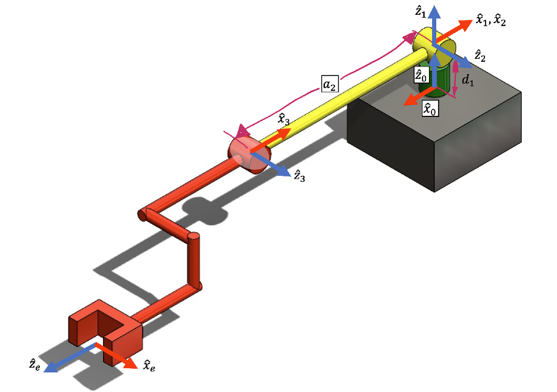

# Homework Assignment 2: Differential Kinematics

## Objective : 
> &ensp;&ensp;&ensp;&ensp;&ensp;การบ้านนี้ถูกออกแบบึ้นมาเพื่อให้ผู้เรียนได้ประยุกต์ใช้องค์ความรู้การหาจลนศาสตร์เชิงอนุพันธ์ (Differential kinematics) ของหุ่นยนต์แขนกล 3 แกน (3-DOF Manipulator)

<br>

## โจทย์
> &ensp;&ensp;&ensp;&ensp;&ensp;นักศึกษาสามารถประยุกต์ความรู้ในเรื่องของการหาจลศาสตร์เชิงอนุพันธ์เพื่อใช้ในการควบคุมหุ่นยนต์ RRR ที่มีลักษณะโครงสร้างดังรูปที่ 1 โดยใช้สมการ Forward Kinematics ที่ทางผู้ผลิดให้มาในฟังก์ชั่น FKHW2.m<br><br>

> <center>รูปที่ 1 การวางเฟรมของหุ่นยนต์ UR5 (แกนในระบบสามมิติ สีแดงคือแกน X สีเขียวคือแกน Y และสีน้ำเงินคือแกน Z)</center>
> โดยที่ <br>
>
>>$d_{1} = 0.0892$ [m] <br>
> $a_{2} = -0.425$ [m] <br>
> $r_{n,e}^{n} = [0, -{\pi\over 2},0]$ [rad] (roll - pitch - yaw) <br>
>
> สมการ Forward Kinematics เขียนอยู่ในรูปของฟังก์ชั่นดังนี้
>
> ```python
>     R,P,R_e,p_e = FKHW2(q)
> ```
> เมื่อ <br>
>> $R(:,:,i) = R_{i}^{0}$ <br>
>> $P(:,i) = p_{0}^{0,i}$ <br>
>> $R_{e} = R_{e}^{0}$ <br>
>> $p_{e} = p_{0,e}^{0}$ <br>
>> $q = q$ <br>
>> $p_{0,i}^{0} \in R^{3 \times 1}$ เป็นเวกเตอร์หลักของ double ที่มีขนาดเท่ากับ 3 ที่แสดงถึงตำแหน่งของจุดกำเนิดของเฟรมพิกัด $F_{i}$ ที่สัมพัทธ์กับจุดกำเนิดของเฟรมพิกัด $F_{0}$ และอ้างอิงกับเฟรมพิกัด $F_{0}$ <br>
> $R_{i}^{0} \in R^{3 \times 3}$ เป็นเมตริกซ์การหมุนของ double ที่มีขนาดเท่ากับ 3x3 ที่แสดงถึงทิศทางหมุนของเฟรมพิกัด $F_{i}$ ที่อ้างอิงกับเฟรมพิกัด $F_{0}$ <br>
> $q \in R^{3}$ เป็นเวกเตอร์หลักของ double ที่มีขนาดเท่ากับ 3 ที่แสดงถึง configuration ของหุ่นยนต์ (Joint Configuration) <br>
> ```python
>      R,P,R_e,p_e = FKHW2([0,0,0])
>```
><br>
> <i><b>คำถามข้อที่ 1 </i></b><br>
> จงเขียนฟังก์ชั่นในการ Jacobian ของหุ่นยนต์ตัวนี้ให้อยู่ในฟังก์ชั่นต่อไปนี้ <br>
>
> ```python
> J_e = endEffectorJacobianHW2(q)
>```
> โดยที่ <br>
>>$J_{e} \in R^{6 \times 3}$ คือเมตริกซ์จาโคเบียนของเฟรมพิกัด $F_{e}$ <br>
>>$q \in R_{3}$ เป็นเวกเตอร์หลักของ double ที่มีขนาดเท่ากับ 3 ที่แสดงถึง configuration ของหุ่นยนต์ (Joint Configuration) <br><br>
>><i><b>หมายเหตุ: </b></i><br>
>> $J_{\omega}^{(e)} = J_{\omega}^{(n)}$ <br>
>> $J_{v}^{(e)} = J_{v}^{(n)} + S(R_{n}^{0}  p_{n,e}^{n})$<br>
>
> <br>
> <i><b>คำถามที่ 2</b></i>
>
> กำหนดให้ Taskspace Variable เป็น $p_{0,e}^{0} = [p_{x},p_{y},p_{z}]$ ในการควบคุมแขนกล RRR พบว่ามีหลายตำแหน่งใน configuration space ที่จะทำให้เกิดสถาวะ Singularity ทำให้ไม่สามารถหาคำตอบของสมการได้ กำหนดให้หุ่นยนต์อยู่ในสภาวะ Sigularity ก็ต่อเมื่อ<br>
>
> $$ ||det(J^{*}(q))|| < ε $$
> <br>
>
>โดยที่ค่า &epsilon; มีค่า 0.001 และ $J^{*}(\cdot)$ คือเมตริกซ์จาโคเบียนที่ถูกลดรูปแล้ว <br>
> จงเขียนฟังก์ชั่นในการหาสภาวะ Singularity
> ```python
>   flag = checkSingularityHW2(q)
> ```
>> $flag \in {0,1}$ เป็น scalar ที่มีค่าเท่ากับ 1 ก็ต่อเมื่ออยู่ตำแหน่งใกล้สภาวะ Singularity หรือมีค่าเท่ากับ 0 เมื่อแขนกลอยู่ในสภาวะปกติ <br>
>> $q \in R^{3}$ เป็นเวกเตอร์หลักของ double ที่มีขนาดเท่ากับ 3 ที่แสดงถึง configuration ของหุ่นยนต์ (Joint Configuration) <br>
>
> <br>
> <i><b> คำถามข้อที่ 3</b></i><br>
> ถ้าหากนักศึกษาติดตั้ง Force Sensor รุ่น FT300 ที่สามารถวัดแรงและแรงควบคู่ในพิกัดสามมิติ โดยติดตั้งในตำแหน่งกึ่งกลางปลายมือของหุ่นยนต์ RRR ในเฟรมพิกัด  สามารถอ่านค่าแรงได้จาก Sensor ดังนี้
>
> $$ w^{e} = \left\lbrack \matrix{n^{e} \cr f^{e}} \right\rbrack $$
>
> จงเขียนฟังก์ชั่นในการหาeffortของแต่ละข้อต่อเมื่อมี wrench มากระทำกับจุดกึ่งกลางของเฟรมพิกัด $F^{e}$
>```python
>   tau = computeEffortHW2(q,w)
>```
>$$\tau = computeEffort(q,w)$$
>> $tau \in R^{3}$ เป็นเวกเตอร์หลักของ double ที่มีขนาดเท่ากับ 3 ที่แสดงถึงค่า Effort ของแต่ละข้อต่อ <br>
> $q \in R^{3}$ เป็นเวกเตอร์หลักของ double ที่มีขนาดเท่ากับ 3 ที่แสดงถึง configuration ของหุ่นยนต์ (Joint Configuration)  <br>
> $w \in R^{6}$ เป็นเวกเตอร์หลักของ double ที่มีขนาดเท่ากับ 6 ที่แสดงโมเมนท์และแรงที่อ้างอิงกับเฟรมพิกัด $F_{e}$ <br>
>><i><b>หมายเหตุ: </b></i><br>
>>
>>$$ f^{A} = R_{B}^{A}\cdot f^{B} $$
>>
>>$$ n^{A} = R_{B}^{A}\cdot n^{B} $$
<br>

## หมายเหตุ
> &ensp;&ensp;&ensp;&ensp;&ensp;ไฟล์ที่มอบให้จะมีทั้งหมด 2 ไฟล์ 1.ไฟล์สำหรับเขียนคำตอบ ("fra333_hw2_xxxx_xxxx_xxxx_xxxx.py") และ 2. ไฟล์ตรวจคำตอบ ("testSctipt.py") ให้นักศึกษาเขียนคำตอบพร้อมทั้งเขียน comment อธิบายลงในไฟล์ .py ที่มอบให้และแก้ไขชื่อไฟล์ให้อยู่ใน format ตามที่กำหนด "fra333_hwx_xxxx_xxxx_xxxx_xxxx.py" ตัวอย่างเช่น ในกลุ่มประกอบไปด้วยนศ.รหัส 61340800001 61340800005 60340800043 59350800078 ดังนั้นชื่อไฟล์ คือ "fra333_hw2_6101_6105_6043_5978.py" 

## วิธีการตรวจคำตอบและให้คะแนน

> - นักศึกษาสามารถเช็คคำตอบจาก testcase ที่อาจารย์กำหนดให้
testcase ดังกล่าวอาศัยการเทียบค่าของคำตอบที่นักศึกษาหามาได้กับเฉลยของอาจารย์ <br>
> - ถ้านักศึกษาสามารถตรวจคำตอบใน testcase ถูกทุกกรณี นักศึกษาจะได้รับคะแนน 4/10 คะแนน <br>
> - ถ้านักศึกษา comment code พร้อมแสดงกระดาษทดในที่มาที่ไปของการเขียน code นักศึกษาจะได้คะแนน 6/10 คะแนน <br>
